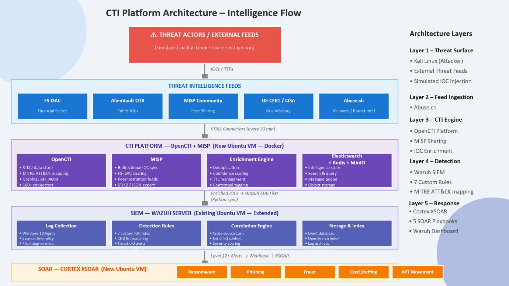
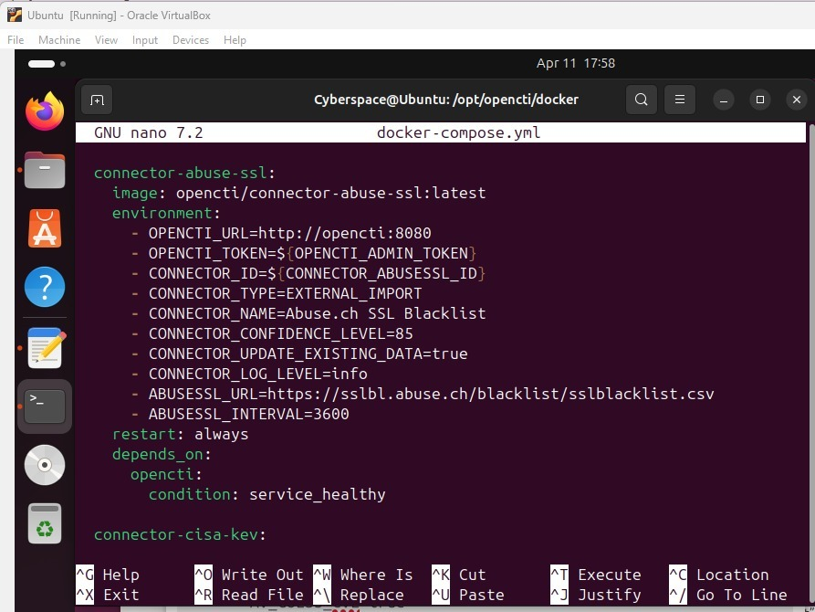
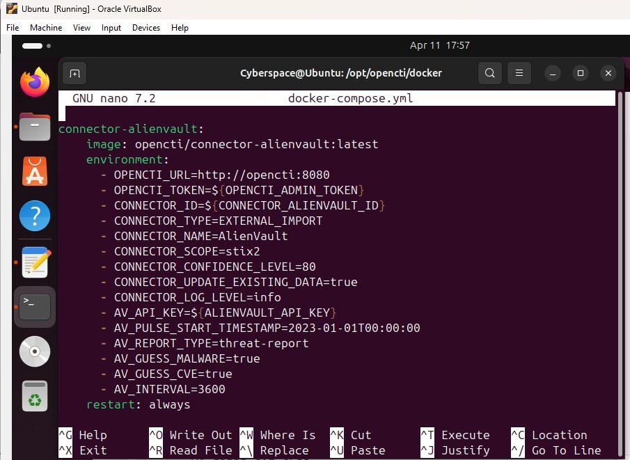
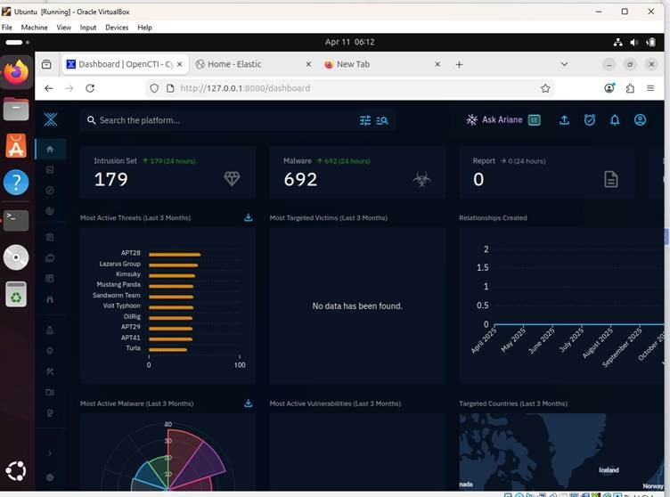
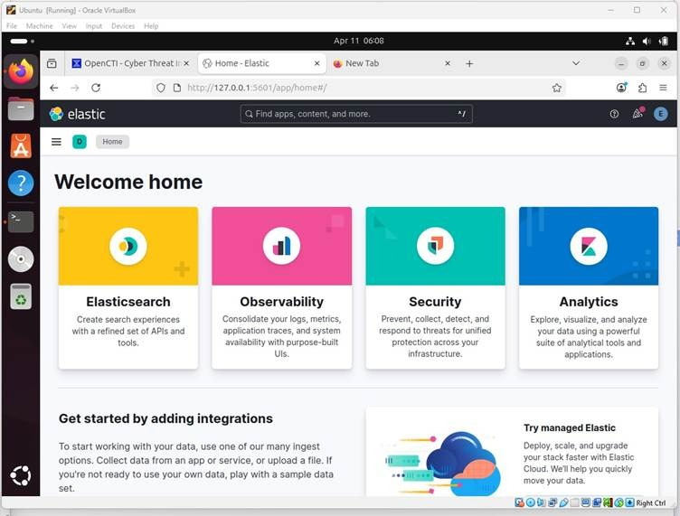

# FinSec-CTI-Platform
# 🛡️ FinSec — OpenCTI Cyber Threat Intelligence Platform

**Client:** Neoglobe Fintech (simulated) · **Team:** Cybersecurity Team B — Expadox Lab Cohort 1, 2026 · **Date:** April 2026

A fully integrated Cyber Threat Intelligence (CTI) platform built with open-source tools — **OpenCTI, MISP, Elastic Stack, and Cortex XSOAR** — to automate threat ingestion, enrichment, detection, and incident response for a fintech environment.

---

## 📌 Executive Summary

Neoglobe Fintech (a simulated digital banking/payments company) had no centralized threat intelligence capability — IOC data was scattered across disconnected tools, detection relied on manual triage, and there was no MITRE ATT&CK-based correlation. This project designed and deployed a five-layer CTI architecture to close those gaps.

**Key outcomes:**
- ⏱️ Mean Time to Detect (MTTD) reduced to **under 5 minutes** through automated IOC correlation
- 🔗 Threat feeds unified in a single OpenCTI platform with deduplication and confidence scoring
- 🎯 Full **MITRE ATT&CK** mapping applied across all detection rules and threat actor profiles
- 🤖 5 SOAR playbooks designed for Tier-1 incident response *(design complete, deployment pending)*

---

## 🏗️ Architecture

The platform follows a five-layer intelligence pipeline, from raw threat feed ingestion through to automated response:

| Layer | Component | Function |
|---|---|---|
| 1 | Threat Surface | External live threat feeds (real-world IOC data) |
| 2 | Threat Feed Ingestion | STIX2 connectors pulling from AlienVault OTX, Abuse.ch |
| 3 | CTI Engine (OpenCTI) | Central STIX2 data store — enrichment, ATT&CK mapping, confidence scoring, TTL tracking (GraphQL, port 4000) |
| 4 | Detection (Elastic Stack SIEM) | Custom EQL rules matching enriched IOCs against live logs |
| 5 | Automated Response (Cortex XSOAR) | *[TBD]* Webhook-triggered SOAR playbooks for high-severity alerts |

---

## 🔌 Threat Feed Sources

| Feed | Category | Intelligence Type |
|---|---|---|
| AlienVault OTX | Public | Malware hashes |
| Abuse.ch | Malware / Botnet | Banking trojan C2 indicators |

**Abuse.ch feed:**

**AlienVault OTX feed:**

**OpenCTI dashboard (IOC enrichment & ATT&CK mapping):**

---

## 🎯 Detection Engineering (MITRE ATT&CK Mapped)

7 custom EQL detection rules were built in Elastic SIEM:

| Scenario | Method | Severity | Rule ID | MITRE Technique |
|---|---|---|---|---|
| Malicious IP Connection | IOC index match | Critical | 100001 | T1071 — C2 Comms |
| Malware Hash Execution | Hash list match | Critical | 100002 | T1204 — User Execution |
| Phishing Domain DNS | Domain list match | High | 100003 | T1566 — Phishing |
| Credential Stuffing | 50+ failures / 60s | High | 100004 | T1110 — Brute Force |
| Ransomware File Pattern | Extension creation rule | Critical | 100005 | T1486 — Encryption |
| Lateral Movement (SMB) | SMB enumeration rule | High | 100006 | T1021 — Remote Services |
| APT C2 Beacon | Periodic outbound pattern | Critical | 100007 | T1071 — App Layer |

Alerts reaching **severity level 12+** are designed to automatically trigger SOAR playbook execution via webhook (pending SOAR deployment).

---

## 🧪 Threat Simulation & Detection Validation

Red team simulations were run from a Kali Linux attacker machine to validate the pipeline:

- **Malicious IP Connection** — Simulated via `curl` to a known malicious IP from the AlienVault OTX feed. OpenCTI matched the IOC and forwarded a Critical alert (T1071) to Elastic SIEM.
- **Phishing Domain (AlienVault OTX)** — DNS resolution to a phishing domain IOC triggered EQL Rule 100003, confirming detection of phishing infrastructure sourced from OTX.
- **Lateral Movement (SMB Enumeration)** — SMB enumeration via Nmap triggered Suricata detection; Elastic SIEM correlated it into a High severity alert (T1021).
- **APT C2 Isolation** — On detecting Rule 100007 (APT C2 beacon), the designed response is to segment the endpoint, block the C2 channel, and share the IOC with FS-ISAC/MISP.

---

## 📈 Impact Summary

- Eliminated scattered, manual IOC hunting across disconnected tools
- Reduced MTTD from hours of manual triage to **under 5 minutes**
- Unified AlienVault OTX + Abuse.ch into one authoritative OpenCTI source with deduplication and confidence scoring
- Every alert now carries full MITRE ATT&CK technique/tactic context
- Reduced analyst fatigue by automating Tier-1 correlation, freeing analysts for Tier-2/Tier-3 investigation
- **[Pending]** Once deployed, the 5 SOAR playbooks are projected to auto-contain 80%+ of Tier-1 incidents

---

## 🚀 Recommendations / Next Steps

1. Deploy Cortex XSOAR and activate the 5 designed playbooks
2. Expand feed coverage — FS-ISAC, PhishTank, Spamhaus, US-CERT/CISA
3. Extend red team simulations to remaining untested rules (credential stuffing, ransomware pattern, APT C2 beacon)
4. Onboard MISP for bidirectional peer intelligence sharing with FS-ISAC institutions
5. Quarterly detection rule tuning to reduce false positives
6. Enforce MFA across OpenCTI, Elastic Stack, and Cortex XSOAR

---

## 🧰 Tech Stack

`OpenCTI` · `MISP` · `Elastic Stack (ELK)` · `Cortex XSOAR` · `STIX2` · `Kali Linux` · `Suricata` · `Docker` · `Ubuntu`

---

*Note: This project was completed as part of the Expadox Lab Cohort 1 (2026) training program, using a simulated fintech client scenario.*
